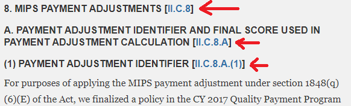

Pretty Federal Register
=================

This chrome extension adds several navigation features to the FR site. It is based around the implicit format that Medicare uses and, as this is merely
an implicit format, may or may not work for other agencies. It automatically runs on any page with
URL of the form `https://www.federalregister.gov/documents/*`.

For an example of what it looks like, install the extension and then navigate to https://www.federalregister.gov/documents/2017/11/16/2017-24067/medicare-program-cy-2018-updates-to-the-quality-payment-program-and-quality-payment-program-extreme

## Table of Contents Improvements
This extension adds hyperlinks to the table of contents, making the items in the TOC link to the
 relevant parts of the document.  The links added by the extension are indicated with red arrows in
 this screenshot:

## Header improvements
This extension modifies the afar page to display the fully qualified path of headers
(e.g. "II.B.1" instead of just "1."). The links added by this extension are indicated with red arrows
in this screenshot:

**License**
Copyright (C) 2017

This program is free software: you can redistribute it and/or modify
it under the terms of the GNU General Public License as published by
the Free Software Foundation, either version 3 of the License, or
(at your option) any later version.

This program is distributed in the hope that it will be useful,
but WITHOUT ANY WARRANTY; without even the implied warranty of
MERCHANTABILITY or FITNESS FOR A PARTICULAR PURPOSE.  See the
GNU General Public License for more details.

You should have received a copy of the GNU General Public License
along with this program.  If not, see <http://www.gnu.org/licenses/>.
